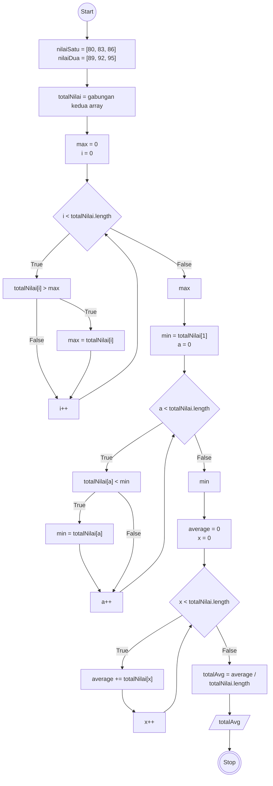

# Membuat program untuk menghitung Max, Min, dan Average

## Memahami Spread operator

### Flowchart

```mermaid
  flowchart TD
  A((Start))
  B["nilaiSatu = [80, 83, 86] nilaiDua = [89, 92, 95]"]
  C[totalNilai = gabungan kedua array]

  D[max = 0
  i = 0]
  F{i < totalNilai.length}
  G["totalNilai[i] > max"]
  H["max = totalNilai[i]"]
  I[i++]
  J[max]

  K["min = totalNilai[1]
  a = 0"]
  L{a < totalNilai.length}
  M["totalNilai[a] < min"]
  N["min = totalNilai[a]"]
  O[a++]
  P[min]
  Q[average = 0
  x = 0]
  R{x < totalNilai.length}
  S["average += totalNilai[x]"]
  T[x++]
  U[totalAvg = average /
  totalNilai.length]
  V[/totalAvg/]
  X(((Stop)))

  A --> B --> C --> D --> F
  F -- True --> G -- True --> H
  I --> F
  G -- False --> I
  H --> I
  F -- False --> J

  J --> K --> L
  L -- True --> M -- True --> N --> O
  M -- False --> O --> L
  L -- False --> P
  P --> Q --> R
  R -- True --> S --> T --> R
  R -- False --> U --> V --> X

```
